# WSO2 Certification Paths

```mermaid
flowchart TD
    START([🎓 WSO2 Certifications]) --> APIM
    START --> MI
    START --> IS
    START --> BAL
    START --> CHOREO
    START --> SA

    %% ─── API Manager Track ───
    subgraph APIM["🔷 API Manager Track"]
        direction TB
        APIM_P["Practitioner V4\n30 MCQ | 90 min"]
        APIM_DEV["Developer V4\n50 MCQ"]
        APIM_EXP["Expert V4\n2 Practical Exams"]
        APIM_SALES["Sales Professional 2024\n50 MCQ"]
        APIM_P --> APIM_DEV --> APIM_EXP
    end

    %% ─── Micro Integrator Track ───
    subgraph MI["🔶 Micro Integrator Track"]
        direction TB
        MI_P["Practitioner V4\n30 MCQ | 90 min"]
        MI_DEV["Developer V4\n50 MCQ"]
        MI_EXP["Expert V4\n2 Practical Exams"]
        MI_SALES["Integration Sales Pro 2024\n50 MCQ"]
        MI_P --> MI_DEV --> MI_EXP
    end

    %% ─── Identity Server Track ───
    subgraph IS["🟣 Identity Server Track"]
        direction TB
        IS_P["Practitioner V7\n30 MCQ | 90 min"]
        IS_DEV["Developer V7\n50 MCQ"]
        IS_EXP["Expert V7\n2 Practical Exams"]
        IS_EXP_V6["Expert V6 ⚠️ Legacy"]
        IS_EXP_V5["Expert V5 ⚠️ Legacy"]
        IS_SALES["IAM Sales Pro 2023\n50 MCQ"]
        IS_P --> IS_DEV --> IS_EXP
    end

    %% ─── Ballerina Track ───
    subgraph BAL["🟢 Ballerina Track"]
        BAL_DEV["Certified Developer\nSwan Lake"]
    end

    %% ─── Choreo Track ───
    subgraph CHOREO["🔵 Choreo Track"]
        CHOREO_SALES["Sales Professional 2025\n50 MCQ"]
    end

    %% ─── Solutions Architect ───
    subgraph SA["🏆 Solutions Architect"]
        SA_ASSOC["Solutions Architect Associate 2025\nMCQ + Scenario-based\nRequires: 2 Developer Certs"]
    end

    %% Solutions Architect prerequisites
    APIM_DEV -->|"prerequisite"| SA_ASSOC
    MI_DEV -->|"prerequisite"| SA_ASSOC
    IS_DEV -->|"prerequisite"| SA_ASSOC

    %% ─── Styling ───
    style START fill:#1a73e8,color:#fff,stroke:#1558b0
    style APIM fill:#e8f4fd,stroke:#1a73e8
    style MI fill:#fff3e0,stroke:#f57c00
    style IS fill:#f3e5f5,stroke:#7b1fa2
    style BAL fill:#e8f5e9,stroke:#388e3c
    style CHOREO fill:#e3f2fd,stroke:#1565c0
    style SA fill:#fff9c4,stroke:#f9a825

    style APIM_P fill:#bbdefb,stroke:#1a73e8
    style APIM_DEV fill:#90caf9,stroke:#1565c0
    style APIM_EXP fill:#1e88e5,color:#fff,stroke:#0d47a1
    style APIM_SALES fill:#e1f5fe,stroke:#0288d1

    style MI_P fill:#ffe0b2,stroke:#f57c00
    style MI_DEV fill:#ffcc80,stroke:#e65100
    style MI_EXP fill:#fb8c00,color:#fff,stroke:#e65100
    style MI_SALES fill:#fff8e1,stroke:#f9a825

    style IS_P fill:#e1bee7,stroke:#7b1fa2
    style IS_DEV fill:#ce93d8,stroke:#6a1b9a
    style IS_EXP fill:#8e24aa,color:#fff,stroke:#4a148c
    style IS_EXP_V6 fill:#f8bbd0,stroke:#c2185b
    style IS_EXP_V5 fill:#f8bbd0,stroke:#c2185b
    style IS_SALES fill:#fce4ec,stroke:#c2185b

    style BAL_DEV fill:#a5d6a7,stroke:#388e3c
    style CHOREO_SALES fill:#90caf9,stroke:#1565c0
    style SA_ASSOC fill:#fff176,stroke:#f9a825
```

---

## Legend

| Level | Description | Format |
|-------|-------------|--------|
| **Practitioner** | Entry level | 30 MCQ, 90 min, no prerequisites |
| **Developer** | Intermediate | 50 MCQ, ~3 months hands-on experience |
| **Expert** | Advanced | 2 Practical exams, requires Developer cert |
| **Sales Professional** | Sales/pre-sales | 50 MCQ |
| **Solutions Architect Associate** | Architect level | MCQ + Scenario-based, requires 2 Developer certs |

---

## Certification Tracks Summary

| Track | Levels Available |
|-------|-----------------|
| 🔷 API Manager | Practitioner → Developer → Expert + Sales Pro |
| 🔶 Micro Integrator | Practitioner → Developer → Expert + Sales Pro |
| 🟣 Identity Server | Practitioner → Developer → Expert (V5/V6 Legacy) + Sales Pro |
| 🟢 Ballerina | Developer (Swan Lake) |
| 🔵 Choreo | Sales Professional |
| 🏆 Solutions Architect | Associate (requires 2 Developer certs) |

> **Note:** Legacy certifications (IS Expert V5 & V6) are still valid but no longer offered for new candidates. It is recommended to pursue the latest V7 track.
>
> 🔗 Register at: [wso2.com/training/certification](https://wso2.com/training/certification)
